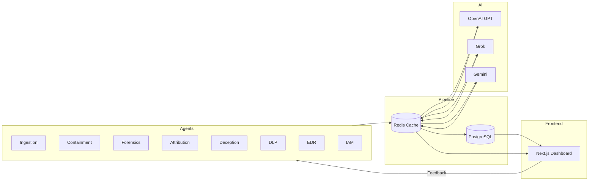

# Mini-XDR: Autonomous AI-Powered Detection & Response Lab

**Disclaimer:** Personal lab project for learning & portfolio. Not affiliated with any employer. All credentials are dummy or managed via Secrets Manager.

**Mini-XDR** is an autonomous AI-powered threat detection and response system built in 2025. 8+ specialized AI agents handle threat detection, containment, forensics, attribution, deception, and automated response. PostgreSQL persistence with Redis caching for high-performance operations. Multi-model LLM reasoning combines OpenAI GPT, Grok, and Gemini for comprehensive threat analysis.

## Architecture



_Source: `docs/diagrams/mini-xdr-architecture.mmd`_

## Current Status

| Capability | Status | Notes |
| --- | --- | --- |
| 8+ autonomous agents (ingestion, containment, forensics, attribution, deception, DLP, EDR, IAM) | ✅ | FastAPI orchestration with coordinated multi-agent execution |
| Real-time pipeline | ✅ | PostgreSQL + Redis caching; multi-source log ingestion |
| Multi-LLM reasoning | ✅ | OpenAI GPT, Grok, and Gemini with intelligent routing |
| Next.js Dashboard | ✅ | Modern React dashboard with real-time updates |
| Agent coordination | ✅ | Advanced multi-agent orchestration and conflict resolution |
| Threat intelligence | ✅ | AbuseIPDB, VirusTotal, and custom intelligence feeds |

## Highlights

- Autonomous pipeline: multi-source ingestion → AI-powered analysis → coordinated agent response
- Multi-model AI reasoning: OpenAI GPT, Grok, and Gemini for comprehensive threat analysis
- Advanced agent coordination: conflict resolution, decision optimization, and collaborative intelligence
- Threat intelligence integration: AbuseIPDB, VirusTotal, and custom intelligence feeds
- Modern observability: health endpoints, structured logging, and real-time monitoring
- Production-ready: Docker containers, database persistence, and scalable architecture

## How to Run

1. Clone the repo:
   ```bash
   git clone https://github.com/chasemad/mini-xdr-v5.git
   cd mini-xdr-v5
   ```
2. (Optional) Create a Python env and install deps:
   ```bash
   python3 -m venv .venv && source .venv/bin/activate
   pip install -r requirements.txt
   ```
3. Configure environment (optional - defaults provided):
   ```bash
   cp backend/env.example backend/.env
   # Edit backend/.env to set API keys (OPENAI_API_KEY, XAI_API_KEY, etc.)
   ```
4. Bring up the stack:
   ```bash
   docker-compose up -d
   ```
5. Check services:
   ```bash
   docker-compose ps
   curl -s http://localhost:8000/health
   ```
6. Run tests (optional):
   ```bash
   ./tests/run_all_tests.sh  # Comprehensive test suite
   ```

## Demo

### Quick Start Demo
1. Start the services: `docker-compose up -d`
2. Access the dashboard: http://localhost:3000
3. Generate test data: `./scripts/inject-fake-attack-auth.sh`
4. Watch real-time threat detection and automated response

### Screenshots
_Agent coordination and threat response visualization:_


## Repo Layout

- `backend/` — FastAPI services, autonomous agents, ML pipelines
- `frontend/` — Next.js dashboard with real-time threat visualization
- `docs/` — comprehensive documentation, architecture diagrams, and guides
- `examples/` — sanitized attack traces and usage examples
- `scripts/` — utility scripts for deployment, testing, and operations
- `config/` — configuration templates and deployment settings
- `ops/` — infrastructure operations and deployment manifests
- `tests/` — comprehensive test suite and integration tests

## Contributing

Contributions are welcome! This is an active project focused on advancing autonomous threat detection.

### How to Contribute
1. Fork the repository
2. Create a feature branch (`git checkout -b feature/amazing-feature`)
3. Make your changes
4. Add tests if applicable
5. Ensure all tests pass
6. Commit your changes (`git commit -m 'Add amazing feature'`)
7. Push to the branch (`git push origin feature/amazing-feature`)
8. Open a Pull Request

### Development Setup
See the [Local Setup Guide](docs/getting-started/local-setup.md) for detailed development instructions.

### Areas for Contribution
- New autonomous agents
- Enhanced ML models
- UI/UX improvements
- Documentation
- Integration with additional threat intelligence sources
- Performance optimizations

### License
This project is licensed under the MIT License - see the [LICENSE](LICENSE) file for details.
